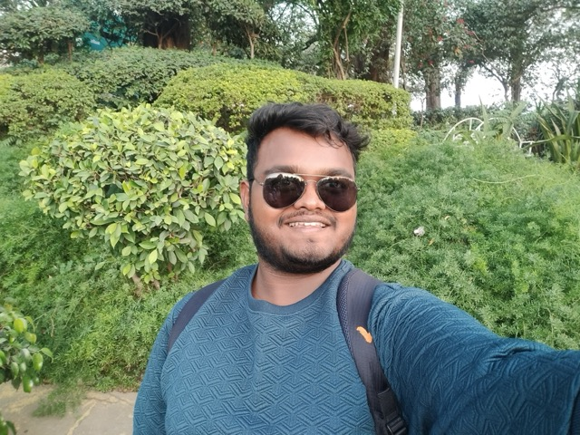
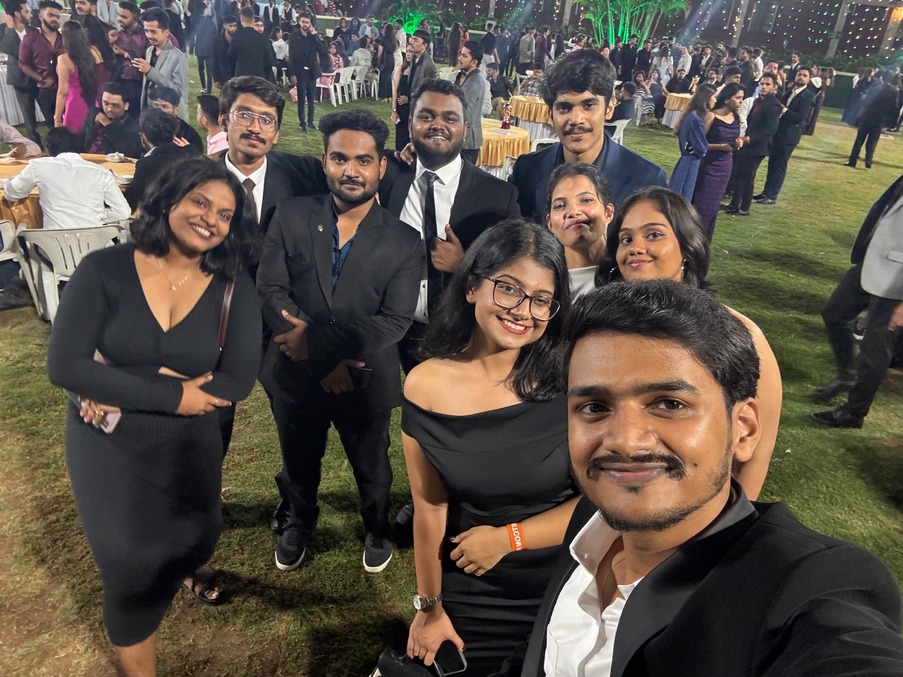
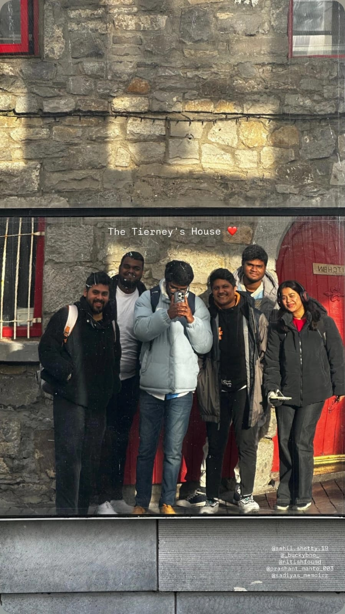
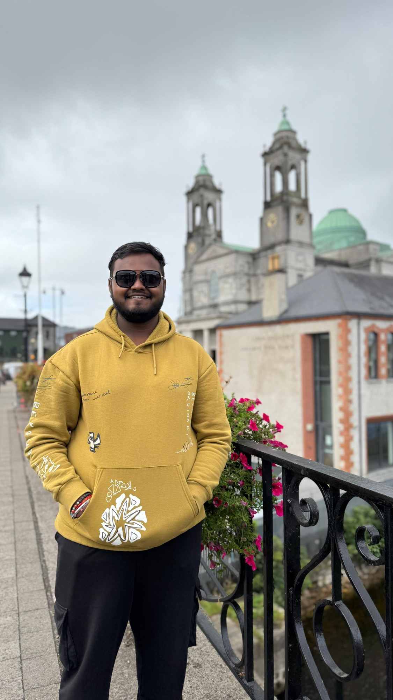
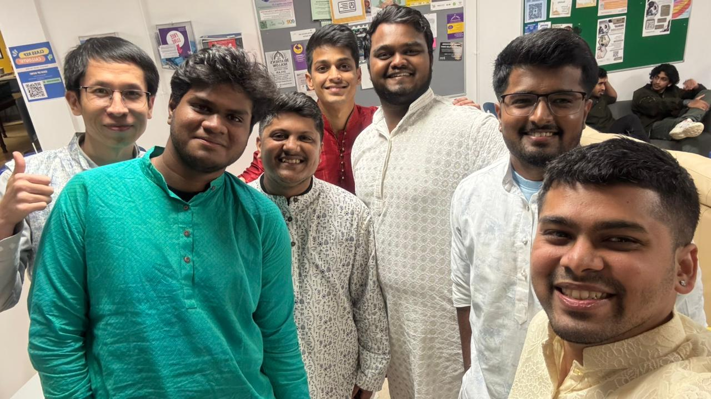
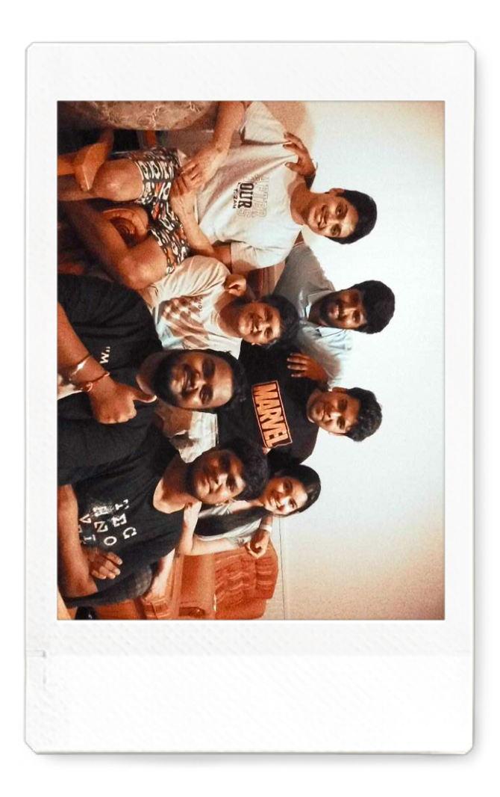

## Hello, World !! Its me Prashant Mahto

I am about to earn my master's degree in Ireland. Today, at the age of 21, I have experienced a lot of things in my life. One year ago, I moved to Ireland for my Master's Degree. A year has passed since then. Far away from home, outside my comfort zone, I have picked up far more than just a degree: I’ve learned essential life skills and started adopting new hobbies. But what brought me here has its own story.

From the very young age computers and technology was always been my favorite subject in school. I was constantly fascinated by how these machines — with just a screen, keyboard, and mouse attached — actually worked. The more I discovered, the more hooked I became. And as fate would have it, I reached a crossroads where I had to decide which career path to pursue. When I received the results of my tenth grade during the COVID lockdown, the decision was made.  Complete Higher Education ——> Complete Bachelor’s in Computer Applications ——> Complete Master’s aboard ——> Get the Job. Sounds simple and straightforward, but the plan gets tougher the deeper you go. So let's take it step by step.

Higher education: well, that unfolded pretty quietly, mostly from home. Since we were in lockdown all the lectures were online. So not much happened during those years. Apart from me getting my first gaming laptop and me getting more leaned towards video games. Drawing which was another one of my favorite subjects in school. I also participated in many drawing competitions as well.  I used to like drawing a lot but for some reason in those years, I suddenly stopped drawing. The only reason I can think of was the lack of peers who used to draw with me that made not feel like drawing anymore cause I was not competing with anyone anymore. Instead, I spent hours playing competitive FPS games with my friends, finding a similar rush of excitement. Its really true that “The people you surround yourself with influence your life in many ways that you don’t even realize”. Lately, I am trying to start drawing again hopefully I find the same excitement and fun I used to get in school days. 

Moving to my Bachelor’s. I completed my bachelor’s from “MIT Art Design and Technology University” in “Loni Kalbhor”, Pune in. I remember someone said “You make some best memories in college life”. I still carry those memories with me everyday. Those three years were easily among the most memorable three years of my life. The campus was huge and beautiful exactly what I had seen in movies — which makes sense, considering it was originally Raj Kapoor's private film studio. I crossed paths with people from all walks of life, building lasting friendships and unforgettable memories. This was the place where I first started coding from very basics of HTML, CSS, Javascript to advance Java and Python. I experienced working with different people for many reasons like organizing events in university festival, taking part in few also while doing group projects and presentations. 

Fast forward to 2025: another major milestone. Standing at the “Mumbai” airport I was experiencing a lot of feelings — I was excited, I was nervous, I was sad. I had spent years planning for this exact moment, yet standing at the departure gate, my heart was racing. Still, somethings I have to be done doesn’t matter if its your first time aboard or you first time leaving family for this long. I am sure every international student who leaves home knows that exact feeling. Flight takeoffs never bothered me before, but this one felt entirely different. I knew I wouldn't be returning anytime soon. A few hours later, there I was: stepping onto completely unfamiliar soil, arriving in Ireland. The moment I look outside the window I knew my life is about to change forever. I was about to meet new people and make new friends. Ireland — what a place it is. Its green, its refreshing, its cold, its peaceful. Exactly the kind of place I want to be. Now a full year has flown by, bringing massive personal growth. My master's program is complete, and this past year has been a masterclass in independence: cooking meals, managing laundry, and truly looking after myself. I have traveled to many places in Ireland met many people.Still, traveling through irish roads a wave of nostalgia hits. I miss the effortless rides on my Chetak (both the name and model of my two-wheeler back home). I miss home-cooked meals from my mom, I miss all the cafes and restaurants I use to go. Yet, I am happy that living in Ireland I am able to experience new things. I am really thankful to my parents for the freedom they gave me experience all of these. Graduations day is next month. While my job hunt is still going on I have also started new hobbies like reading books, I started blogging (This is my first blog by the way), I do plan to start drawing again. May be some day I start posting my art work as well. who knows what my future awaits for me. 

> *“Sometimes a Journey is not always about the destination but also about the things that we experience and the people we meet”*
>
> *— said by some intelligent person (maybe)*

---
